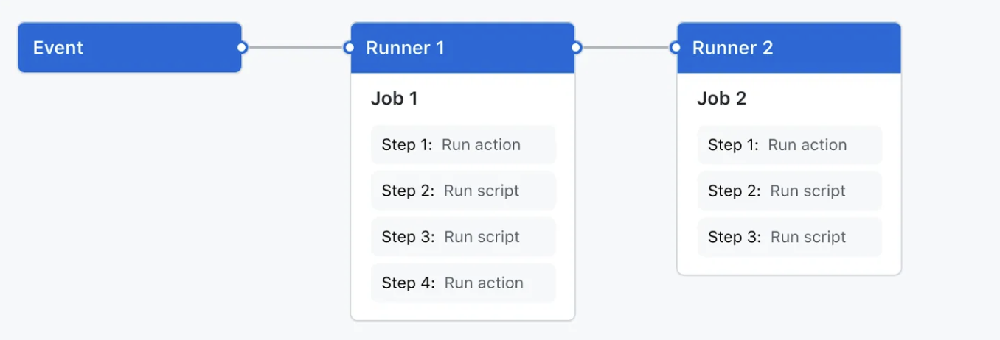
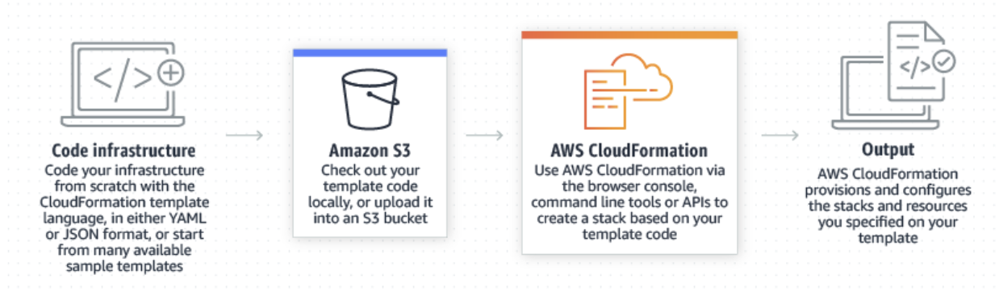

## 1. A importância de CI/CD no desenvolvimento de software e como ele melhora a eficiência dos times de desenvolvimento
A implementação de CI/CD (Integração Contínua e a Entrega Contínua) é uma prática de DevOps muito utilizada na automatização de processos de desenvolvimento de software e gerenciamento de infraestrutura. Ela consiste em pipelines atuomatizadas que, além de diminuir a complexidade do processo de deploys no dia a dia, reduzem o tempo necessário para a implementação de novas versões de um software, trazendo uma melhoria notável na eficiência de times de desenvolvimento.
Nesse sentido, através da utilização dessa prática de DevOps, é possivel:
- Diminuir a probabilidade de erros humanos nos processos de deploy;
- Diminuir o tempo de lançamento de atualizações em softwares;
- Padronizar processos de forma consistente;
- Diminuir a complexidade e simplificar as atividades de implantação;
- Trazer transparência para as atividades de implantação.
## 2. A estrutura e os componentes principais de um workflow do GitHub Actions
O GitHub Actions é um recurso da plataforma GitHub, e auxilia no processo de automatização de fluxos de trabalho (workflows) de desenvolvimento de software. Esses workflows são processos automatizados relacionados a um repositório especifico que se localiza no GitHub, e podem ser responsáveis por buildar, testar, empacotar, liberar ou implantar seu projeto.
### Componentes
- workflows
- eventos
- jobs
- steps
- actions 

Para que um <b>workflow</b> seja trigado, deve ser configurado um <b>evento</b> que o acione (como a abertura de um Pull Request, por exemplo). Cada workflow contém um ou mais <b>jobs</b> que vão ser executados da forma que desejar (sequencialmente ou paralelamente).
Cada um desses jobs irá rodar dentro de uma máquina virtual <b>runner</b>, ou dentro de um container, e contém um ou mais <b>steps</b> - que rodam um script ou uma <b>action</b>.

Mas como funcionam os workflows? Um workflow é definido a partir de um arquivo .YAML que deve estar presente no caminho `.github/workflows` no seu repositório do GitHub, e que será responsável por conter os jobs que devem ser rodados quando algum evento ocorrer, ou quando for trigado manualmente.

## 3. A função e a importância do AWS CloudFormation na automação da infraestrutura
O AWS CloudFormation é um serviço de IaC (infraestructure as Code) utilizado para gerenciar uma infraestrutura da AWS através de código, e facilita muito na automatização da construção, manutenção e aplicação de mudanças a softwares hospedados na AWS.

### template de exemplo
Para exemplificar, de forma prática, a criação do YAML do cloudformation, foi anexado um template de exemplo: [template.yaml](./cloudformation/template.yaml).

Esse template de cloudformation cria e configura a infraestrutura necessária para configurar um pipeline de CI/CD usando GitHub Actions e CodeDeploy. Através deste template, diversos recursos da AWS são configurados automaticamente, incluindo instâncias EC2, VPC, subredes, Auto Scaling e Load Balancer. Além disso, são criados roles IAM para permitir que os serviços realizem ações específicas com permissões adequadas.

## 4. Como a integração de GitHub Actions com AWS CloudFormation e Amazon EC2 pode ser aplicada em projetos reais
A integração do GitHub Actions com o CloudFormation pode ser utilizada para o provisionamento de recursos em máquinas virtuais EC2, visando automatizar o processo de desenvolvimento e deployment de software de maneira contínua e eficiente. Essa abordagem é eficiente, escalável e segura para o desenvolvimento, deployment e gerenciamento de aplicações, alinhando-se perfeitamente com boas práticas de DevOps utilizadas atualmente.
Pensando no escopo de automatização de processos de software através de uma abordagem de CI/CD, existem diversos casos de uso que podem trazer benefícios, como: 
- Automatização de deployments
- Gerencimento de infraestrutura como código (IaC)
- Escalabilidade automática
- Ciclo de vida completo de desenvolvimento - desde o commit do código até a implantação em produção, incluindo testes automatizados, verificações de segurança, análises estáticas...
- Redução de erros e aumento da eficiência.

### Desafios encontrados e soluções
- O AWS Cloudformation é um pouco limitado quando se fala de diferentes ambientes em cloud, visto que só permite um gerenciamento de recursos na nuvem da AWS. Porém, quando o objetivo é automatizar a implantação de softwares que utilizam de outras nuvens, como Azure, foi encontrada a solução de utilizar o GitHub Actions em conjunto com o Terraform, que tem o mesmo papel do cloudformation, mas com uma flexibilidade maior em relação às clouds.
- Manter as credenciais de acesso à AWS seguras e bem gerenciadas é muito importante, e acaba sendo um ponto de atenção, porque expor essas chaves de acesso ou permissões excessivas pode levar a vulnerabilidades de segurança do software. Além disso, foram encontradas dificuldades ao utilizarmos do AWS Academy, visto que algumas das chaves e credencias são temporárias, e precisam ser atualizadas periódicamente. Para enfrentar essas dificuldades, foi achada a solução de utilizar o AWS Identity and Access Management (IAM) para aplicar o princípio de menor privilégio e usar secrets management, como GitHub Secrets.
## Referências
AMAZON Web Services, Inc. ou suas afiliadas. Integrating with GitHub Actions CI/CD Pipeline to Deploy a Web App to Amazon EC2. 2024. Disponível em: https://aws.amazon.com/pt/blogs/devops/integrating-with-github-actions-ci-cd-pipeline-to-deploy-a-web-app-to-amazon-ec2/. Acesso em: 19 maio 2024.

GITHUB, Inc. Understanding GitHub Actions. 2024. Disponível em: https://docs.github.com/en/actions/learn-github-actions/understanding-github-actions. Acesso em: 19 maio 2024.

AMAZON Web Services, Inc. ou suas afiliadas. AWS CloudFormation. 2023. Disponível em: https://aws.amazon.com/pt/cloudformation/. Acesso em: 19 maio 2024.
